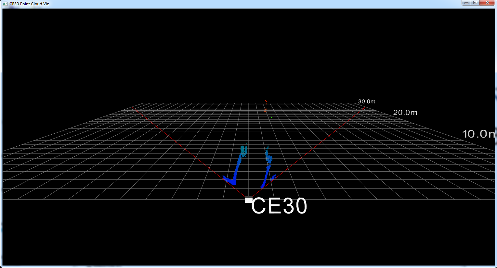

This page is set up for CE30-D SDK technical support. For product information about CE30 series and other Benewake products, please visit our [offical website](http://www.benewake.com/en/index.html).

---

#### Get Started

The `ce30_viz` provides a set of tools to visualize CE30-D measurement data. All of these programs can be built and run on both Windows and Linux platforms. So far, we have tested them on Intel Core i7 PCs with 64-bit Windows 7, 64-bit Windows 10 and Ubuntu 16.04 x86_64, separately. You can built from source codes after correctly installing all dependencies. Besides, we have pre-built binaries along with every release for Windows. Therefore, we recommend you downloading the latest binary at first when you are using Windows 7/10. If this does not work for you, you might have to build from source then.

#### Version

- 1.10.0

#### Dependencies

- [PCL](http://www.pointclouds.org) 1.7
- [CMake](https://cmake.org/) 2.8.1
- C++11
- [ce30_driver](https://codincodee.github.io/ce30_driver) 1.3.0
- [Qt](https://www.qt.io/) 5.6

#### Recommend Configurations

- [Ubuntu](https://www.ubuntu.com/) 16.04 x86_64 or 64-bit Windows 10
- [GCC-C++](https://gcc.gnu.org) 5.4.0 or [MSVC](https://www.visualstudio.com) 2015 64 bits

#### Download

- [Point Cloud Viewer for Windows](https://github.com/codincodee/ce30_viz/releases/download/v1.10.0/ce30_pointcloud_viewer_v1_10_0_win10_x86_64.zip)

#### Quick Access

- [Official Website](http://www.benewake.com/en/index.html)
- [ce30_driver](https://codincodee.github.io/ce30_driver)
