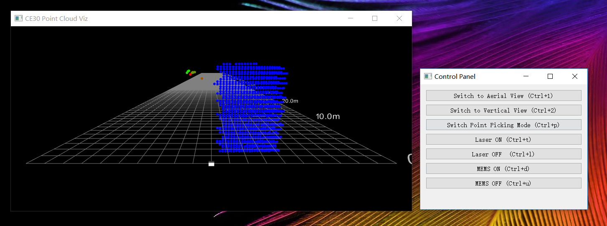

## X项目上位机使用手册

#### 准备工作

网线连接连接传感器后，需将以太网IPv4地址配置为192.168.0.3，子网掩码配置为255.255.255.0，并保存配置。

#### 启动上位机

需使用管理员权限启动上位机软件visualizer.exe

#### 上位机功能

1. 切换鸟瞰图视角：点击Control Panel的`Switch to Aerial View`按钮或按下快捷键`Ctrl+1`。
2. 切换垂直视角：点击Control Panel的`Switch to Vertical View`按钮或按下快捷键`Ctrl+2`。
3. 开启/关闭选点模式：点击Control Panel的`Switch Point Picking Mode`按钮或按下快捷键`Ctrl+p`。选点模式开启后，在点云显示界面按住`Shift`键的同时鼠标左键点击空间任意点可获得其三位坐标。该座标将以米为单位先窗口标题栏显示。关闭选点模式后该功能失效。
4. 启动激光扫描：点击Control Panel的`Laser ON`按钮或按下快捷键`Ctrl+t`。
5. 关闭激光扫描：点击Control Panel的`Laser OFF`按钮或按下快捷键`Ctrl+l`。
6. 开启MEMS：点击Control Panel的`MEMS ON`按钮或按下快捷键`Ctrl+d`。
7. 关闭MEMS：点击Control Panel的`MEMS OFF`按钮或按下快捷键`Ctrl+u`。

#### 视角切换

1. 旋转：鼠标左键拖住点云显示界面上的任意点。
2. 平移：按住`Shift`键的同时按住鼠标左键拖住点云显示界面上的任意点。